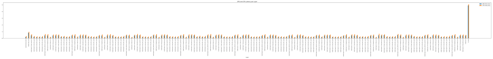

# LLM Performance Analysis on the Jetson Xavier AGX

This repository contains the code, documentation, and resources for analyzing and optimizing large language model (LLM) performance on resource-constrained edge devices. The project specifically targets the **NVIDIA Jetson AGX Xavier (32GB)**, exploring techniques like detailed performance profiling.

---

### Setup & Installation

This project was developed and tested on the NVIDIA Jetson AGX Xavier (32GB). The following steps will help you set up the required environment.

**System Requirements:**
* **Jetson AGX Xavier (32GB)**
* **JetPack:** 5.1.1 (L4T 35.3.1)
* **CUDA:** 11.4
* **Python:** 3.8.12

**1. Environment Creation with Conda**

It is recommended to use `miniconda` to manage the Python environment.

```bash
# 1. Install miniconda if you haven't already. Ensure you have enough space (approx. 4GB).

# 2. Activate the base conda environment (adjust the path to your installation)
source ~/miniconda3/bin/activate

# 3. Create and activate a new environment for this project
conda create --name llm_env python=3.8.12 -y
conda activate llm_env
```

**2. Install Dependencies**

First, install the correct version of PyTorch for your Jetson device.

```bash
# Install PyTorch v2.0.0 for Jetson with JetPack 5.1.1
conda install -c conda-forge huggingface_hub numpy=1.24.4 -y
export TORCH_INSTALL=https://developer.download.nvidia.cn/compute/redist/jp/v511/pytorch/torch-2.0.0+nv23.05-cp38-cp38-linux_aarch64.whl
pip install --no-cache $TORCH_INSTALL
```

Next, install the required Hugging Face libraries.

```bash
# Install Transformers and Accelerate
conda install -c conda-forge transformers=4.45.0 -y
pip install accelerate>=0.26.0
```

---

## Supported Models

This project provides utilities and code for the following models:

* **Llama-3.2-1B**
* **Llama-3.2-1B-Instruct**
* **Qwen1.5-MoE-A2.7B**

---

## Features & Utilities

This repository is structured to provide a range of utilities for each model, from downloading to detailed performance analysis.

### Llama-3.2-1B

This model is the most feature-rich in this repository, providing a full suite of tools for experimentation.

* **Download:** A script to download the model included.
* **Partitioning:** Code for single-device split inference is available in `src/Llama-3.2-1B/partitioning/`.
* **Profiling:** Scripts for detailed performance analysis, including:
    * Latency and power consumption measurements.
    * GPU-only performance metrics.
* **Text Generation:** A variety of examples are available to demonstrate inference:
    * `generate.py`: Standard text generation.
    * `pipeline.py`: Hugging Face pipeline example.
    * `streaming.py`: Streaming generation for interactive applications.
    * `token_by_token.py`: A script for generating text one token at a time.
* **Testing:** Code to compare batching vs. non-batching inference located in `src/Llama-3.2-1B/testing/`.

### Llama-3.2-1B-Instruct

The Instruct version of Llama-3.2-1B comes with the following utilities:

* **Download:** A script to download the model is included.
* **Text Generation:** An example of using the Hugging Face pipeline for text generation can be found in `src/Llama-3.2-1B-Instruct/text_generation_examples/`.

### Qwen1.5-MoE-A2.7B

For this Mixture-of-Experts (MoE) model, the focus is on profiling the unique aspects of its architecture.

* **Download:** A script to download the model is included.
* **Profiling:** A comprehensive set of tools for performance analysis:
    * **Latency and Power:** Scripts to measure the latency and power consumption for both a full forward pass and for only the activated experts.
    * **Experts per Token:** Scripts to generate data on which experts are activated for each token.
* **Generation:** A script for single token generation is provided in `src/Qwen1.5-MoE-A2.7B/generation/`.

---

## Target Hardware

All code and benchmarks in this repository are optimized and tested for the **NVIDIA Jetson AGX Xavier (32GB)**. This ensures that the results and configurations are tailored for this specific edge device.

---

## Example Measurements

Here are some example measurements generated by the profiling scripts.

**Llama 3.2 1B - Latency and Power Measurements per layer**



**Llama 3.2 1B - Throughput Measurements**


**Qwen1.5-MoE-A2.7B - Transformer Layer 2 Experts Only Latency and Power Measurements**


